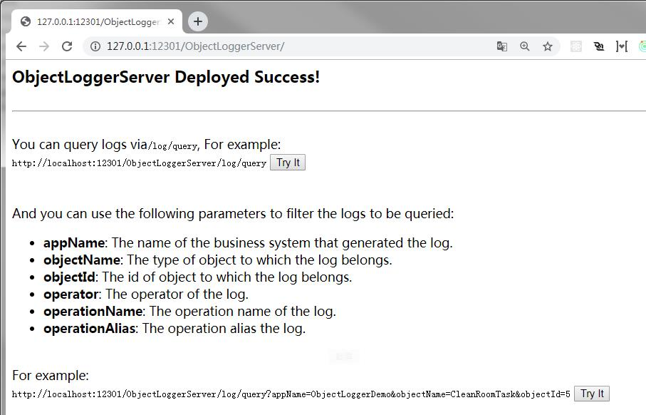

# ObjectLogger

[中文说明](./README_CN.md)

The powerful and easy-to-use object log system, supports writing and querying of object attribute changes.

A lot of system need to log the change of objects:

- Object attributes change
- User action on object

After that, we can query all log.

This project can help you to collect and query log.


# 1 System Advantages

- Based on SpringBoot, can run as jar.
- Completely decouple from service system.
- Supports sharing by multiple systems
- The business system provides jar to analysis and write the change of object.
- User-defined object change description
- Supports comparisons of rich text objects
- Supports extension of more object attribute types

# 2 System Deployment

## 2.1 DataBase

User script `/database/init_data_table.sql` to init two data table.

## 2.2 ObjectLogger

1. Download this project from git.
2. Configure `/src/main/resources/application.properties`:
```
spring.datasource.driver-class-name ={db_driver}
spring.datasource.url =jdbc:mysql://{your_mysql_address}/{your_database_name}
spring.datasource.username ={your_database_username}
spring.datasource.password ={your_database_password}
```
3. Use maven to get jar package.
4. Run jar by `java -jar ObjectLogger-1.0.1.jar`. Default port is `8080`。



## 3.3 How to use in Business System

### 3.3.1 add maven dependency

```
<dependency>
    <groupId>com.github.yeecode.objectLogger</groupId>
    <artifactId>ObjectLoggerClient</artifactId>
    <version>1.0.4</version>
</dependency>
```

More info about the dependency : [ObjectLoggerClient](https://github.com/yeecode/ObjectLoggerClient)

### 3.3.2 add bean autowire

If Business System is SpringBoot：
```
@SpringBootApplication
@ComponentScan(basePackages={"{your_beans_root}","com.github.yeecode.objectLogger"})
public class MyBootAppApplication {

public static void main(String[] args) {
    SpringApplication.run(MyBootAppApplication.class, args);
}
}
```

If Business System is Spring：
```
<context:component-scan base-package="com.github.yeecode.objectLogger">
</context:component-scan>
```

### 3.3.3 add conf for ObjectLoggerClient

Add in `application.properties`:

```
object.logger.add.log.api=http://{your_ObjectLogger_address}/ObjectLogger/log/add
object.logger.appName={your_app_name}
```

{your_app_name} is the name of business system.

### 3.3.4 add a bean implements LocalTypeHandler

```
@Service
public class LocalTypeHandlerBean implements LocalTypeHandler {

    @Override
    public ActionItemModel handleLocalType(String subLocalType, String oldValue, String newValue) {
        return null;
    }
}
```

End.

# 4 How to Use

We can query all logs via `/ObjectLogger/log/query`, and use param to filter logs:


Add `LogClient` before use：
```
@Autowired
private LogClient logClient;
```

## 4.1 Simple Use

Use in business system：
```
logClient.sendLogForItems("TaskModel",5,"actor name","addTask","add Task","via web page","some comments",null);
```

Then, query in ObjectLogger：
```
http://{your_ObjectLogger_address}/ObjectLogger/log/query?appName=myBootApp&objectName=TaskModel&objectId=5
```

We can get ：
```
{
  "respMsg": "SUCCESS",
  "respData": [
    {
      "id": 16,
      "appName": "myBootApp",
      "objectName": "TaskModel",
      "objectId": 5,
      "actor": "actor name",
      "action": "addTask",
      "actionName": "add Task",
      "extraWords": "via web page",
      "comment": "some comments",
      "actionTime": "2019-04-10T10:56:15.000+0000",
      "actionItemModelList": []
    }
  ],
  "respCode": "1000"
}
```

## 4.2 Auto Diff

Use in business system：

```
TaskModel oldTaskModel = new TaskModel();
oldTaskModel.setId(9);
oldTaskModel.setTaskName("oldName");
oldTaskModel.setUserId(3);
oldTaskModel.setDescription("\t<p>the first line</p>\n" +
        "\t<p>the second line</p>\n" +
        "\t<p>the 3th line</p>");

TaskModel newTaskModel = new TaskModel();
newTaskModel.setId(9);
newTaskModel.setTaskName("newName");
newTaskModel.setUserId(5);
newTaskModel.setDescription("\t<p>the first line</p>\n" +
        "\t<p>the second line</p>\n" +
        "\t<p>the last line</p>");

logClient.sendLogForObject(9,"actor name","editTask","edit Task","via app",
"some comments",oldTaskModel,newTaskModel);
```

Then, query in ObjectLogger：

```
http://{your_ObjectLogger_address}/ObjectLogger/log/query?appName=myBootApp&objectName=TaskModel&objectId=9
```

We can get ：

```
{
  "respMsg": "SUCCESS",
  "respData": [
    {
      "id": 15,
      "appName": "myBootApp",
      "objectName": "TaskModel",
      "objectId": 9,
      "actor": "actor name",
      "action": "editTask",
      "actionName": "edit Task",
      "extraWords": "via app",
      "comment": "some comments",
      "actionTime": "2019-04-10T10:56:17.000+0000",
      "actionItemModelList": [
        {
          "id": 18,
          "actionId": 15,
          "attributeType": "NORMAL",
          "attribute": "taskName",
          "attributeName": "TASK",
          "oldValue": "oldName",
          "newValue": "newName",
          "diffValue": null
        },
        {
          "id": 19,
          "actionId": 15,
          "attributeType": "USERID",
          "attribute": "userId",
          "attributeName": "USER",
          "oldValue": "USER:3",
          "newValue": "USER:5",
          "diffValue": "diffValue"
        },
        {
          "id": 20,
          "actionId": 15,
          "attributeType": "TEXT",
          "attribute": "description",
          "attributeName": "DESCRIPTION",
          "oldValue": "\"\\t<p>the first line</p>\\n\\t<p>the second line</p>\\n\\t<p>the 3th line</p>\"",
          "newValue": "\"\\t<p>the first line</p>\\n\\t<p>the second line</p>\\n\\t<p>the last line</p>\"",
          "diffValue": "Line 6:<br/>&nbsp;&nbsp;&nbsp; -： <del> the 3th line </del> <br/>&nbsp;&nbsp; +： <u> the last line </u> <br/>"
        }
      ]
    }
  ],
  "respCode": "1000"
}
```

But this function need `@LogDescription`. Attributes without `@LogDescription` will be ignored when object diff.

In this example：

```
@LogDescription(name = "TASK")
private String taskName;

@LogDescription(name = "USER",type = AttributeTypeEnum.LOCALTYPE,localType = LocalTypeHandlerBean.USERID)
private Integer userId;

@LogDescription(name = "DESCRIPTION",type = AttributeTypeEnum.TEXT)
private String description;
```

How to use `@LogDescription`：

- name: required，it is the `attributeName` in log.
- type：enum item in `AttributeTypeEnum`, default value is `AttributeTypeEnum.NORMAL`.
    - AttributeTypeEnum.NORMAL：log the new value and old value，leave diff value as `null`
    - AttributeTypeEnum.TEXT: diff rich text.
    - AttributeTypeEnum.LOCALTYPE：self define mode, and `localType` is required for more info.
- localType：User when `type = AttributeTypeEnum.LOCALTYPE`, then `localType`/newValue/oldValue will be passed to the bean implements LocalTypeHandler.

```
@Service
public class LocalTypeHandlerBean implements LocalTypeHandler {

    public static final String USERID = "USERID";

    @Override
    public ActionItemModel handleLocalType(String subLocalType, String oldValue, String newValue) {
        ActionItemModel logActionItemModel = new ActionItemModel();

        if (subLocalType.equals(USERID)) {
            logActionItemModel.setNewValue("USER:" + newValue);
            logActionItemModel.setOldValue("USER:" + oldValue);
            logActionItemModel.setDiffValue("diffValue");
        } else {
            logActionItemModel = null;
        }
        return logActionItemModel;
    }
}
```
